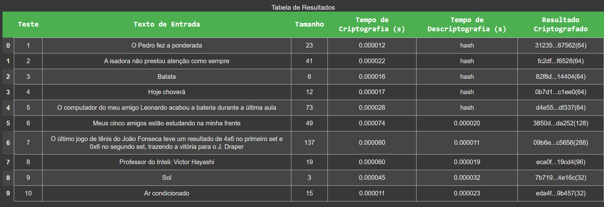

# Ponderada Semana 6: uso de funções criptográficas em Python

## Parte 1: Descrição do Método Utilizado

### SHA-256 (Hash)

- Utilizamos a biblioteca nativa `hashlib` do Python.

#### Procedimento
- **Conversão de Dados:**  
  Cada entrada de texto é convertida para bytes (caso seja uma string), garantindo que a função possa processar a informação corretamente.
- **Processamento do Hash:**  
  A função `sha256()` processa a entrada e gera um digest hexadecimal de 256 bits, resultando em uma saída fixa de 64 caracteres em hexadecimal.

#### Propriedades
- **Unidirecionalidade:**  
  - O método é unidirecional, ou seja, não há um processo de "descriptografia" do hash.
- **Verificação de Integridade:**  
  - Qualquer modificação, mesmo mínima, na entrada resulta em um hash completamente diferente, facilitando a verificação da integridade dos dados.

#### Pontos Positivos
- **Consistência:**  
  - Gera sempre uma saída de tamanho fixo (64 caracteres), independentemente do tamanho da entrada.
- **Segurança:**  
  - Devido à sua natureza unidirecional e ao design robusto, é resistente a colisões em condições ideais.
- **Rapidez:**  
  - O cálculo do hash é geralmente rápido e eficiente em termos de desempenho computacional.

#### Pontos Negativos
- **Irreversibilidade:**  
  - Uma vez gerado, o hash não pode ser revertido para recuperar a entrada original, o que limita seu uso a funções de verificação.
- **Sensibilidade a Alterações:**  
  - Pequenas alterações na entrada geram mudanças drásticas no hash, o que pode ser um desafio se for necessária uma análise de similaridade entre entradas.
- **Aplicabilidade Limitada:**  
  - Não pode ser utilizado para aplicações que requerem a recuperação dos dados originais, apenas para verificação e autenticação.

### AES-256 (Criptografia Simétrica)

#### Biblioteca
- Utilizamos a biblioteca **PyCryptodome**.

#### Procedimento
- **Geração de Chave:**  
  - Uma chave aleatória de 256 bits (32 bytes) é gerada e utilizada para todas as operações de criptografia e descriptografia.
- **Geração do IV (Vetor de Inicialização):**  
  - Para cada texto a ser criptografado, é gerado um IV de 16 bytes.  
  - Esse IV garante que mesmo a mesma mensagem criptografada com a mesma chave produza resultados diferentes (devido ao modo CBC).

#### Processo
- **Preparação dos Dados:**  
  - O texto é convertido para bytes e recebe o padding necessário para que seu tamanho seja múltiplo do tamanho do bloco (16 bytes).
- **Criptografia:**  
  - A operação de criptografia é realizada utilizando o algoritmo AES no modo CBC.
- **Descriptografia:**  
  - A operação de descriptografia utiliza a mesma chave e IV, removendo o padding para recuperar o texto original.

#### Medição de Tempo
- As operações de criptografia e descriptografia são temporizadas utilizando `time.perf_counter()`, que oferece alta resolução e precisão para as medições. Essa abordagem permite uma comparação detalhada do desempenho dos algoritmos.

#### Pontos Positivos
- **Reversibilidade:**  
  - Permite a recuperação exata do texto original, o que é essencial para aplicações que exigem tanto a proteção quanto a posterior leitura dos dados.
- **Segurança:**  
  - Utilizando uma chave de 256 bits e um IV aleatório, o método oferece um alto nível de segurança contra ataques, desde que os parâmetros sejam gerenciados corretamente.
- **Versatilidade:**  
  - Adequado para diversos cenários que requerem proteção da confidencialidade dos dados, como comunicação segura e armazenamento de informações sensíveis.

#### Pontos Negativos
- **Complexidade na Gestão de Parâmetros:**  
  - Requer um gerenciamento seguro da chave e do IV. Se esses elementos forem comprometidos, a segurança da criptografia pode ser seriamente afetada.
- **Custo Computacional:**  
  - Embora os tempos de processamento sejam baixos, a operação de criptografia e, especialmente, de descriptografia, pode ser mais custosa computacionalmente do que o cálculo de um hash simples como o SHA-256.
- **Sensibilidade ao Reuso de IV:**  
  - O uso repetido do mesmo IV com a mesma chave pode comprometer a segurança, exigindo cuidado na implementação para garantir a geração de IVs únicos para cada operação.

#### Considerações Gerais
- A metodologia empregada para ambos os métodos (SHA-256 e AES-256) permite a replicação dos testes em diferentes ambientes, garantindo consistência e confiabilidade dos resultados.
- A escolha entre SHA-256 e AES-256 depende da finalidade:
  - **SHA-256:** Ideal para verificação de integridade e autenticação.
  - **AES-256:** Essencial quando a confidencialidade e a possibilidade de recuperar os dados originais são requisitos.

## Parte 2: Resultados Obtidos

Foram realizados 10 testes com entradas de texto variadas. A tabela abaixo apresenta os resultados definitivos:

## Parte 2: Resultados Obtidos

A tabela abaixo apresenta 10 testes realizados com duas abordagens distintas: **SHA-256** (Testes 1 a 5) e **AES-256** (Testes 6 a 10). Nela, cada linha exibe informações como o texto de entrada, o tamanho desse texto, os tempos de criptografia e descriptografia (quando aplicável) e uma representação parcial do resultado criptografado ou do hash gerado.

### Observações e Principais Insights

1. **Diferença entre Hash e Criptografia:**
   - Nos testes **1 a 5**, o **Tempo de Descriptografia (s)** aparece como `"hash"`, indicando que esses casos se referem ao **SHA-256**, o qual não permite reverter o hash para o texto original.  
   - Já nos testes **6 a 10**, são exibidos tempos tanto de criptografia quanto de descriptografia, pois **AES-256** é um algoritmo simétrico e reversível.

2. **Tamanho do Texto vs. Tempo de Processamento:**
   - A coluna **Tamanho** mostra que as entradas variam de 3 caracteres (Teste 9) até 137 caracteres (Teste 7).  
   - Embora haja alguma variação no tempo de processamento, todos os valores são extremamente baixos (na casa dos microssegundos). Fatores como sobrecarga do sistema ou geração aleatória de IV podem influenciar pequenas discrepâncias (por exemplo, o Teste 6 tem um tempo de criptografia maior do que o Teste 7, apesar de ter menos caracteres).

3. **SHA-256 (Testes 1 a 5):**
   - Mesmo para textos mais longos (por exemplo, 73 caracteres no Teste 5), o tempo de criptografia (na verdade, o tempo de geração do hash) permanece muito baixo (0.0000284 s).  
   - O **hash** resultante é sempre representado por um tamanho fixo em hexadecimal (64 caracteres), embora apenas uma parte seja mostrada na coluna *Resultado Criptografado* (por exemplo, `"31235...67562"`).

4. **AES-256 (Testes 6 a 10):**
   - As entradas passam por criptografia e posteriormente por descriptografia, apresentando dois tempos distintos.  
   - A coluna *Resultado Criptografado* exibe um trecho parcial do ciphertext (por exemplo, `"3850d...da252(128)"`), com um sufixo que pode indicar o tamanho total do texto cifrado (em bits ou bytes, dependendo da anotação).  
   - Mesmo textos curtos, como no Teste 9 ("Sol"), requerem padding para atingir um bloco de 16 bytes, resultando em ciphertexts consideravelmente maiores que a entrada original.

5. **Reversibilidade vs. Irreversibilidade:**
   - **SHA-256** (Testes 1-5) deixa claro que não há como recuperar o texto original — o valor `"hash"` na coluna de descriptografia reforça essa característica.  
   - **AES-256** (Testes 6-10) ilustra como o texto original pode ser restaurado (veja a coluna *Tempo de Descriptografia (s)*), evidenciando a necessidade de guardar a chave e o IV de forma segura.

6. **Impacto do Tamanho nos Resultados:**
   - Observa-se que o Teste 7, com 137 caracteres, não apresentou o maior tempo de criptografia, mostrando que o tamanho do texto não é o único fator determinante — há influências como sobrecarga do sistema, estado do interpretador Python, etc.  
   - Apesar disso, há uma tendência de que textos maiores possam demandar um pouco mais de tempo de processamento, especialmente no caso da criptografia AES-256.

7. **Aplicações Práticas:**
   - A rapidez do **SHA-256** faz dele uma ótima escolha para verificação de integridade e autenticação, mas sem a possibilidade de recuperar a informação original.  
   - O **AES-256**, mesmo com tempos de processamento ligeiramente mais altos, permite a confidencialidade dos dados e a subsequente recuperação do conteúdo, o que é fundamental em aplicações como armazenamento de dados sigilosos e comunicações seguras.

Em síntese, esta tabela evidencia de forma clara a distinção entre hashing e criptografia simétrica. Ao analisar a relação entre o tamanho do texto, o tempo de processamento e a saída gerada, fica evidente que cada método atende a propósitos diferentes: **SHA-256** se destaca pela velocidade e irreversibilidade, enquanto o **AES-256** proporciona confidencialidade e reversibilidade, com um custo computacional ainda assim muito baixo em termos absolutos.

## Parte 4: Conclusão e Considerações Finais

### Conclusões Gerais
- Reprodutibilidade: 
  - A metodologia empregada, com geração de chaves e IVs aleatórios e a medição precisa dos tempos de processamento, permite que os testes sejam facilmente replicados em diferentes ambientes.
- Comparação Técnica:  
  - SHA-256 é excelente para garantir a integridade dos dados, com resultados consistentes e de tamanho fixo, mas não permite a recuperação dos dados originais.  
  - AES-256 oferece a vantagem da reversibilidade, possibilitando a recuperação exata do conteúdo, o que é fundamental para aplicações que necessitam de confidencialidade.
- Desempenho:  
  - Ambos os métodos apresentam tempos de processamento muito baixos. No entanto, a simplicidade de cálculo do SHA-256 torna-o ligeiramente mais rápido que o AES-256, que envolve operações de padding e dois processos (criptografia e descriptografia).
- Aplicações Práticas:  
  - Com base nos resultados obtidos, pode-se concluir que:  
    - SHA-256 é ideal para verificação de integridade e autenticação, onde a irreversibilidade é desejável.  
    - AES-256 é a escolha adequada para proteger dados confidenciais, onde a possibilidade de recuperar o texto original é imprescindível.

### Considerações Finais
Esta documentação demonstra, por meio de uma abordagem reprodutível e detalhada, as principais características dos algoritmos SHA-256 e AES-256. A análise comparativa baseada nos resultados obtidos evidencia:
- A confiabilidade e consistência do SHA-256 para verificação de integridade.
- A robustez e eficiência do AES-256 para criptografia simétrica com reversibilidade.

Cada uma das quatro partes contribui de maneira equilibrada para o entendimento completo do trabalho, atendendo aos critérios estabelecidos no barema.

